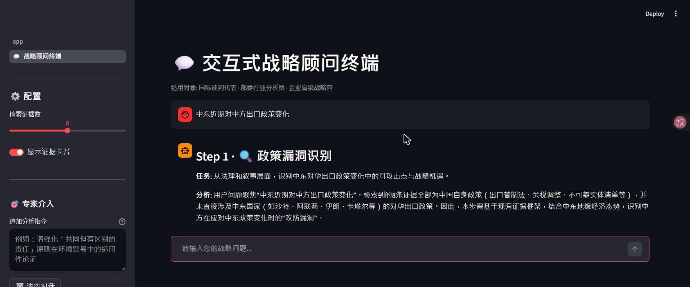
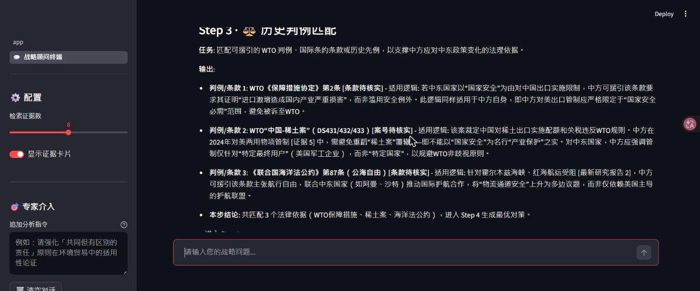
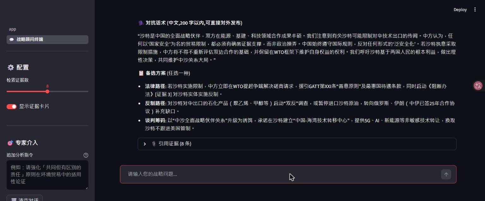

# GTSNA — 全球贸易战略导航系统 (Global Trade Strategic Navigation Agent)

> **Code-only public mirror** of the MVP frontend (app + pages + core). The crawler, raw data, and DuckDB workspace are not included.

## Screenshots

**Strategic advisor terminal — a question kicks off a 4-step adversarial analysis** (vulnerability scan → evidence rebuttal → precedent matching → strategy generation):



**Step 3 — WTO precedent matching with applicability reasoning:**



**Step 4 — negotiation strategy, ready-to-publish talking points, and fallback options:**



An MVP Streamlit application for strategic trade analysis. It combines text
embeddings, a DuckDB analytical store, web search (Serper), and an LLM
(DeepSeek) to power a multi-turn strategic-advisory experience.

> Status: MVP. The strategic-advisor terminal is functional; the macro
> dashboard, time-series/spillover, and rare-earth network modules are
> placeholders under development.

## Modules

| Module | Status | Description |
|---|---|---|
| 💬 战略顾问终端 (Strategic Advisor Terminal) | Working | Multi-turn adversarial strategic Q&A over trade data |
| 📊 全球宏观看板 (Global Macro Dashboard) | Planned | — |
| 📈 时序与溢出分析 (Time-series & Spillover) | Planned | — |
| 🕸️ 稀土网络沙盘 (Rare-earth Network Sandbox) | Planned | — |

## Project structure

```
app.py                     # Streamlit entry point (warm-up + welcome page)
pages/                     # Streamlit multipage UI (战略顾问终端 …)
core/
  shared_resource.py       # Cached singletons: embedder, DuckDB, LLM client
  web_search.py            # Serper-backed web search
  logic_mod1.py            # Module-1 business logic
crawler/                   # Data collection (google_auto_delivery)
scripts/                   # 01_build_duckdb.py, search/LLM/stress tests, pack_deliverable.sh
docs/                      # Development worklogs
db_workspace/              # DuckDB workspace (gtsna.duckdb — git-ignored)
raw_data/                  # Collected source data (git-ignored)
```

## Setup

```bash
python -m venv .venv && source .venv/bin/activate   # Windows: .venv\Scripts\activate
# Key dependencies: streamlit, duckdb, requests, an embeddings model, and an
# OpenAI-compatible client for DeepSeek. (Pin these in a requirements.txt.)
cp .env.example .env        # then fill in your keys
streamlit run app.py
```

## Environment variables

See `.env.example`:

- `SERPER_API_KEY` — Serper.dev web-search API key
- `DEEPSEEK_API_KEY` — DeepSeek LLM API key

The real `.env`, `.venv/`, `raw_data/`, and the DuckDB files are git-ignored.
